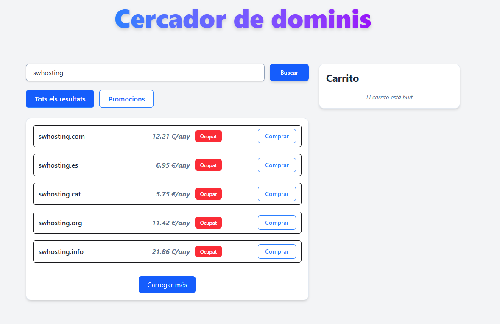
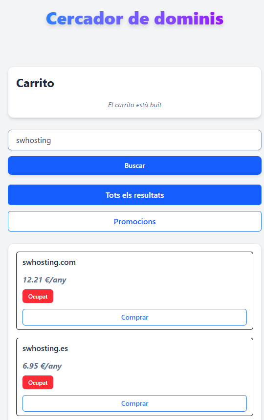

# SWHosting - Prova Tècnica – Junior Full Stack Web Developer

## Requisits tècnics

-   PHP (>= 8.1)
-   Composer
-   Node.js (>= 18.x)
-   NPM

## Instal·lació

1. Clonar el repositori

```bash
git clone https://github.com/aniolmorenobatlle/SWHosting-Prova1
cd SWHosting-Prova1
```

2. Instal·lar les dependències de PHP

```bash
composer install
```

3. Instal·lar les dependències de Node.js

```bash
npm install
```

4. Crear el fitxer d'entorn

```bash
cp .env.example .env
```

5. Afegir el token al fitxer `.env`

```env
TOKEN_API= <token>
```

6. Executar el projecte

```bash
npm run build
php artisan serve
```

7. Accedir al projecte

Obre el navegador i accedeix a `http://localhost:8000`.

## Explicació breu d'arquitectura

L'arquitectura del projecte es basa en un projecte Laravel amb Livewire i Tailwind CSS. El projecte utitliza peticions a una API de SWHosting per obtenir l'informació dels dominis, tant el preu, com la dispoinibilitat.
El projecte utilitza Livewire per gestionar la interacció amb l'usuari i actualitzar la interfície d'usuari sense necessitat de recarregar la pàgina. Tailwind CSS s'utilitza per estilitzar els components de la interfície d'usuari.
Per guardar les dades del carret de compra, s'utilitza la sessió de Laravel. Això permet que les dades es mantinguin disponibles durant la sessió de l'usuari sense necessitat d'emmagatzemar-les a la base de dades.

## Captures del projecte

### Format escriptori



### Format mòbil



## Autor i Contacte

**Nom:** Aniol Moreno Batlle  
**Correu:** [aniolmoreno@gmail.com](mailto:aniolmoreno@gmail.com)  
**GitHub:** [https://github.com/aniolmorenobatlle](https://github.com/aniolmorenobatlle)
